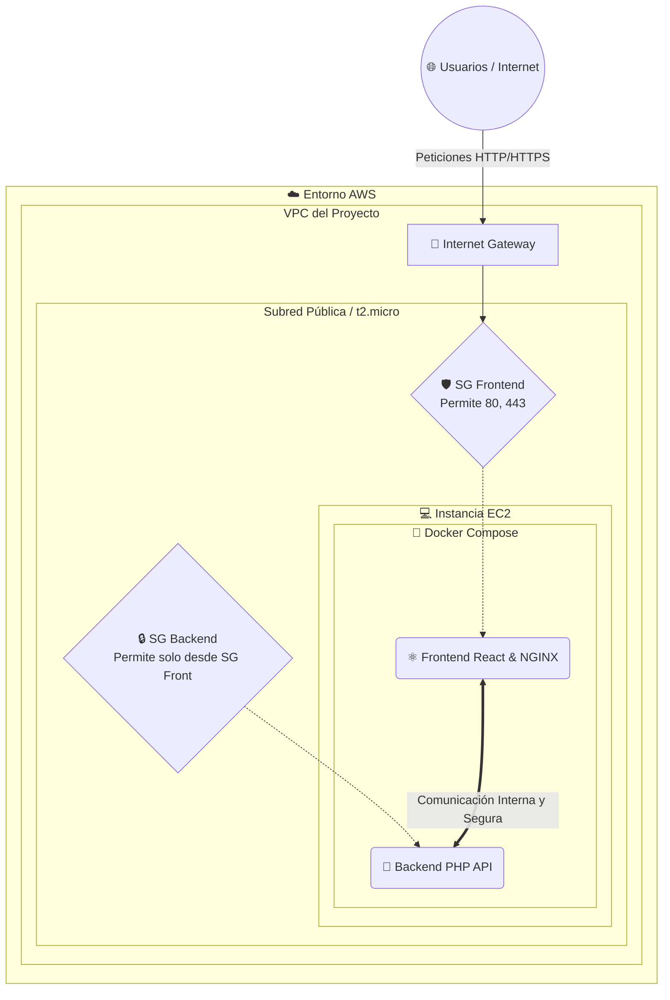

# Proyecto TFG: Aplicación Full-Stack en AWS

**🔗 Live Demo:** [https://nasaro-aws.duckdns.org/](https://nasaro-aws.duckdns.org/)

¡Bienvenido al repositorio de mi Trabajo de Fin de Grado! Este proyecto despliega una aplicación web completa y su infraestructura en la nube de Amazon Web Services (AWS) de forma totalmente automatizada. 

## 1. La Aplicación (Un Vistazo Rápido)

La aplicación sigue una arquitectura clásica cliente-servidor, empaquetada para funcionar en cualquier entorno sin dolores de cabeza:

- **Frontend:** Desarrollado en **React** (para una experiencia de usuario rápida y reactiva).
- **Backend:** Desarrollado en **PHP**, para gestionar toda la lógica de negocio técnica de la base de datos y la API.
- **Orquestación:** Todo el conjunto se maneja mediante **Docker** y **Docker Compose**. De este modo, la clásica excusa de *"en mi máquina funciona"* desaparece, asegurando el mismo comportamiento en local y en la nube.

Dentro de la carpeta `/app` se aloja todo el código correspondiente listo para ser levantado.

---

## 2. La Infraestructura: Arquitectura y Decisiones (Lo Interesante)

El verdadero potencial de este proyecto radica en su infraestructura, gestionada como código (**IaC**) empleando **Terraform**. El modelo de despliegue sobre AWS se ha construido bajo una máxima inquebrantable: **eficiencia, automatización total y economía.**

### 🗺️ Diagrama de Arquitectura (VPC)



### 💸 ¿Por qué esta arquitectura y no otra? (La filosofía Free Tier)

Dentro del universo de AWS hay cientos de servicios (como *ECS Fargate* para correr contenedores sin servidor, balanceadores *ALB*, base de datos manejada *RDS*, etc). Sin embargo, utilizarlos a la ligera puede inflar los costes rápidamente.

El objetivo fue diseñar un sistema potente pero **100% acogido a la capa gratuita (Free Tier)** de Amazon para que el coste mensual sea literalmente de **0.00$**.

Por ello tomamos estas decisiones:

- **EC2 `t2.micro`:** La instancia reina del Free Tier. Su vCPU y 1 GiB de RAM son lo justo y necesario. Usarla de "host de Docker" nos ahorra pagar por orquestadores administrados.
- **El Truco del SWAP:** Dado que 1 GiB de RAM se queda corto al compilar código o levantar varios contenedores pesados a la vez, el script de arranque configura automáticamente un **archivo Swap de 2GB** en el disco EBS. Así se dota a la máquina de "memoria virtual" para que nunca reviente por falta de recursos (Out Of Memory).
- **Amazon Linux 2023:** Un sistema operativo ágil, sin bloatware, con tiempos de arranque mínimos y optimizado a nivel de núcleo para conectarse al ecosistema AWS.

### 🤖 Automatización y el "User Data"

Nadie entra al servidor a instalar cosas manualmente. Terraform inyecta en la máquina, en el momento que nace, un script (`user_data`) que lo hace todo:
1. Actualiza paquetes.
2. Instala Git, Docker y el plugin de Compose directo del repo oficial.
3. Fabrica la memoria SWAP de respaldo.
4. Clona el repositorio oficial de la app directamente de GitHub.
5. Ejecuta `docker-compose up` e inicializa los servicios.

Sencillamente: lanzas Terraform, esperas dos minutos y **la web está viva conectada al backend.**

### 🔒 Seguridad de Red: Lo que entra y lo que sale

La comunicación con el mundo exterior se ha configurado al milímetro usando Security Groups (`security.tf`):

- **Puertos 80 (HTTP) y 443 (HTTPS) [Frontend]:** Son los únicos realmente expuestos al mundo (`0.0.0.0/0`), de modo que *"el mundo entero pueda ver y navegar por tu React"*.
- **Aislamiento del Backend:** El Security Group dedicado para los contenedores de backend no filtra direcciones IP, sino que **solo acepta tráfico que provenga del grupo de seguridad del Frontend**. Es un muro infranqueable desde redes externas.

🚨 **Sobre el acceso SSH (Puerto 22):**
Ahora mismo verás en las reglas del Firewall de AWS que el puerto de SSH está abierto al `0.0.0.0/0`. Esto es deliberado **solo para la etapa de desarrollo** y despliegues iniciales del TFG, para permitir entrar fácilmente en caso de "apagar fuegos".

> 🛡️ **En un entorno para Producción esto sería inaceptable.** Para pasar a producción, se borraría esa regla global y se reemplazaría por una que limite el acceso SSH **única y exclusivamente a mi propia IP pública**, bloqueando cualquier intento de conexión de bots o agentes externos.

---

## 3. Continuous Deployment (GitOps)

El proyecto no muere en el despliegue inicial. He configurado **GitHub Actions** para que cualquier cambio en el código se despliegue automáticamente en la instancia de AWS mediante un flujo de SSH seguro, garantizando que la web siempre esté actualizada con el último commit.

---

## 4. Despliegue en 3 pasos

Si tienes configurado en tu CLI las claves de tu AWS:

```bash
cd infra
terraform init
terraform plan
terraform apply --auto-approve
```

¡Cierra los ojos, cuenta hasta 100 y tu TFG estará alojado en la red más potente del mundo! ☁️
